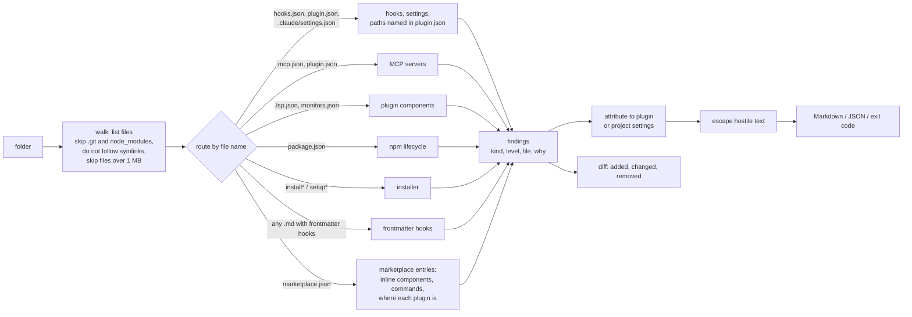

# agent-scanner

[](https://github.com/amirg76/agent-scanner/actions/workflows/test.yml)

**Before you install an extension for your AI coding agent, see what it declares will run without asking you.**

Claude Code plugins, skill packs and project configs can register code that runs on its own: hooks
that fire on every tool call (in plugin files, project settings, or a skill's own frontmatter), MCP
servers, commands behind the status line or the API-key helper, scripts that run on `npm install`,
project settings that pre-approve shell commands or MCP servers, and installers that overwrite files in
`~/.claude`. `agent-scanner` reads an extension and lists the declarations it knows how to read — see
[What it detects](#what-it-detects) and [Limits](#limits) — in one report, before you install.

- **Static.** Nothing is installed, executed or sent anywhere.
- **Deterministic.** No LLM, no network. Same input, same report.
- **Zero dependencies.** Node.js 20+, standard library only.
- **Hardened against the repo it reads.** Text from the scanned repo cannot add headings, links or
  terminal control codes to a report; symlinks are not followed.
- **CI-ready.** Markdown or JSON output, exit code on a threshold.

## What a report looks like

```text
$ node bin/agent-scanner.mjs ./my-project --title my-project
# my-project

2 files listed. 5 findings: 2 high, 3 attention, 0 info.

## Commands run by configuration (settings, MCP servers)

- **ATTENTION** [project settings] `apiKeyHelper`: `echo fixture-key`
  `.claude/settings.json` — Generates the API credential with a command.
- **ATTENTION** [project settings] `statusLine`: `echo status`
  `.claude/settings.json` — Runs a command to render the status line.

## Permissions and approvals granted by project settings

- **HIGH** [project settings] allow `Bash(sh -c:*)`
  `.claude/settings.json` — Pre-approves any shell command for everyone who opens this project.
- **HIGH** [project settings] setting `enableAllProjectMcpServers:true`
  `.claude/settings.json` — Approves every server in project .mcp.json files without a prompt.
- **ATTENTION** [project settings] setting `enabledMcpjsonServers:alpha,beta`
  `.claude/settings.json` — Approves 2 project MCP server(s) without a prompt.

## Limits

- Static reading of declared configuration. Nothing was installed or executed.
- Scripts called by a hook are listed by command, not analysed.
- Tool descriptions and skill text are not checked for prompt injection; use a content scanner for that.
```

Exit code `1`, because a `high` finding is present. (This is the `fixtures/settings-commands` example.)

## What it found in 20 popular repos

I ran it on 20 widely used Claude Code plugin, skill and config repos (about 24k to 296k GitHub
stars; code as of September 2026, star counts October 2026) and reviewed each audit by hand. Full results: [`audits/`](audits/README.md).

- **5 of 20 declare nothing that runs on its own.**
- **270 hooks** in 12 of them; **78** are declared in skill or subagent frontmatter. 70 of those are in
  one repo that ships 14 copies of the same skill, and only 5 are where its plugin loads skills; the rest
  are copies for other agent tools and translations. **34** hooks keep their code inline in the command.
- **31** hooks or MCP servers run a registry package with no pinned version (`@latest`, `@alpha`, no version, or a git URL without a ref).
- **4 high findings**: three project templates that pre-approve every shell command, and one template
  project whose settings approve all of its MCP servers without a prompt.
- Nothing was judged malicious. Many hooks are exactly what a plugin is for.

## Why this and not a content scanner

Most agent-security scanners read **text**: tool descriptions and skill files, looking for prompt
injection. That matters, and tools like [snyk/agent-scan](https://github.com/snyk/agent-scan) and
[cisco-ai-defense/skill-scanner](https://github.com/cisco-ai-defense/skill-scanner) do it well.
Anthropic's own [skill and plugin scanning](https://support.claude.com/en/articles/15927065-get-started-with-skill-and-plugin-scanning)
states that "MCP servers and hooks … aren't scanned at this time".

`agent-scanner` reads the other half: **behaviour that is declared to run automatically**. Use both.

## Usage

```bash
git clone https://github.com/amirg76/agent-scanner
cd agent-scanner
node bin/agent-scanner.mjs <folder>                      # Markdown report
node bin/agent-scanner.mjs <folder> --json               # machine-readable
node bin/agent-scanner.mjs <folder> --fail-on attention  # exit 1 on attention or higher
node bin/agent-scanner.mjs --version
```

Exit codes: `0` nothing at or above the threshold (default `high`) and every relevant file read, `1`
found, `2` bad input, `3` nothing found at the threshold but a file that could declare something was
not read or not interpreted (too large, invalid JSON, an unexpected shape, or behind a link, which is
never followed). A `3` is not a clean result: read "Not checked". `node_modules`, skipped by design, does
not cause it.

Under the default threshold, `0` means **no `high` finding**, not "safe to install": hooks, MCP servers
and other things that run are `attention`. Use `--fail-on attention` to fail on anything that runs.

Run on this repository itself, it reports the examples in `fixtures/` (by design) and one `info` hit
of the installer heuristic on its own source file `src/detectors/installer.mjs`.

### Check an update before accepting it

```bash
node bin/agent-scanner.mjs diff <old folder|scan.json> <new folder|scan.json>
```

Lists hooks, servers and commands that were **added, changed or removed** between two versions, and
exits `1` if anything new at `attention` or above appears. A declaration whose file the new version
could not read is listed as **no longer checked**, not removed, and also exits `1`. On ECC v2.1.0 → a September 2026 commit it
reported 4 hooks added, 9 changed, 1 removed.

## What it detects

| kind | example | level |
|---|---|---|
| hook | `PreToolUse` on every tool; `SessionStart`; a hook in a skill's frontmatter; `npx pkg@latest` | attention |
| settings-command | `statusLine`, `apiKeyHelper`, an MCP server's `headersHelper`, a marketplace entry's `command` source, and other command settings | attention |
| permission | `Bash`, `Bash(*)`, `Bash(sh -c:*)` allowed; `bypassPermissions`; `enableAllProjectMcpServers` | high |
| env | `ANTHROPIC_BASE_URL` set by project settings | high |
| mcp | `npx -y some-server` with no version | attention |
| lsp / monitor | a plugin language server or background monitor | attention |
| lifecycle | `postinstall`, `prepare` in `package.json` | attention |
| installer | a script that copies into `~/.claude` with no backup code | attention |

Levels describe what is **declared**, not intent. A finding is attributed to a plugin only when its
file is where Claude Code loads that plugin's components, or it is declared in the plugin's marketplace
entry; project settings are labelled as such.
Details: [`docs/FINDINGS.md`](docs/FINDINGS.md).

## How it works



Architecture, data model and design decisions: [`docs/ARCHITECTURE.md`](docs/ARCHITECTURE.md).

## How it is tested

- **24 fixtures**, each an inert example (never executed; hooks only `echo`, and the two installer
  fixtures contain a `cp` line for the installer detector to find) with an `expected.json`. Exact-match
  mode counts extra findings, so false positives fail the build.
- **121 tests** in total: fixtures, parser unit tests, the CLI as a real process, diff mode, hostile
  input (Markdown injection through every field, terminal escapes, linear-time checks on 200K-character
  inputs, paths outside the folder, symlinks), the frontmatter parser, the audit tooling, and a check
  that the repository contains no invisible or bidirectional control characters.
- **CI** on Linux with Node 20, 22 and 24, and on Windows and macOS with Node 24.
- **Calibration on real repos, then AI-assisted review passes.** Running on real extensions found
  problems the fixtures did not; separate AI-assisted security, code and reader reviews before
  publication found more. Every problem and its fix is listed in [`docs/ENGINEERING-NOTES.md`](docs/ENGINEERING-NOTES.md); every code fix has a test.

```bash
npm test
```

## Limits

- Reads declared configuration. Scripts that a hook calls are listed, not analysed.
- Does not check skill or tool-description text for prompt injection (use a content scanner).
- Installer detection is a text heuristic on `install*` / `setup*` files.
- Plugins listed in a marketplace but hosted in other repos are not fetched; the report says how many,
  under "Not checked". Components a marketplace entry declares inline are read.
- Whether Claude Code honours a given setting in project scope is not modelled; the declaration is reported.
- Frontmatter is read with a small YAML-subset parser; a file outside that subset is reported as not
  parsed, not guessed. Block scalars (`|`, `>`) are read without their blank and comment lines.
- MCP bundles (`.mcpb`, `.dxt`) named in `plugin.json` are listed as not read; their contents are not
  unpacked.
- File names are matched without regard to letter case, as Windows and macOS file systems do. On a
  case-sensitive file system, `.Claude/settings.json` is reported although Claude Code would not find it.
- Hook entries that are not in the documented shape (for example another tool's own keys) are not counted
  as hooks; each such file is listed under "Not checked".
- Levels describe a declaration, not whether the workspace trust dialog or an MCP approval prompt
  would stand in front of it in an interactive session.

## Related work

Small projects that also look at hooks: [hook-scanner](https://github.com/Santhosh595/hook-scanner),
[cc-plugin-audit](https://github.com/STRML/cc-plugin-audit).

## Security

To report a problem in the scanner itself, see [`SECURITY.md`](SECURITY.md). To correct an audit, open
an issue with the "Audit correction" template.

## License

MIT. See [`LICENSE`](LICENSE).
