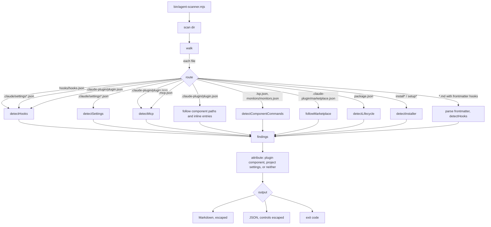

# Architecture

For anyone who wants to understand, change or extend the scanner.

## Principles

1. **Read, never run.** The scanner reads configuration files and reports what they declare will run.
   It does not install, execute, import or contact anything.
2. **The scanned repo is hostile.** Its text must not be able to shape the report, reach the terminal,
   make the scanner read outside the folder, or stall it.
3. **Deterministic.** No LLM and no network, so the same input always gives the same report. That is
   what makes a report citable, and what makes `diff` meaningful.
4. **Zero dependencies.** Standard library only. A security tool that pulls a dependency tree is itself
   a supply-chain risk.
5. **Say what was checked, not more.** When the scanner cannot see something (an installer whose writes
   happen in another module, a folder it skipped), it says so instead of guessing.

## Layout

```text
bin/agent-scanner.mjs          CLI: arguments, output, exit code; strips control codes from output
src/scan.mjs                   scan(dir): walk, route files to detectors, follow manifest paths,
                               attribute findings to plugins or project settings
src/walk.mjs                   file list; skips .git and node_modules, does not follow symlinks,
                               records what it did not look into
src/text.mjs                   escaping for hostile text: code spans, prose, table cells, controls
src/frontmatter.mjs            YAML-subset parser for skill and subagent frontmatter
src/report.mjs                 Markdown report
src/diff.mjs                   compare two scans
src/detectors/hooks.mjs        Claude Code hooks
src/detectors/settings.mjs     permissions, MCP approvals, command settings, env in project settings
src/detectors/mcp.mjs          MCP servers and version pinning (npx, bunx, uvx, pnpm dlx, docker)
src/detectors/components.mjs   plugin language servers (.lsp.json) and monitors (monitors.json)
src/detectors/marketplace.mjs  marketplace entries: inline components, command sources, plugin locations
src/detectors/lifecycle.mjs    npm scripts that run on install
src/detectors/installer.mjs    install*/setup* scripts that write into ~/.claude
tools/                         audit tooling (not needed to use the scanner)
fixtures/                      inert example extensions with expected results
test/                          node --test suites; test/run.mjs passes the files explicitly (CI runs Node 20, 22, 24)
```

## Data flow



A file over 1 MB is listed under `skipped`. Invalid JSON is listed under `errors`. Neither stops the scan.
`node_modules` folders and symlinks are listed under `skipped` too; `.git` is skipped silently.

## The finding model

Every finding is a flat object:

- `kind`: `hook` · `settings-command` · `permission` · `env` · `mcp` · `lsp` · `monitor` · `lifecycle` · `installer`
- `level`: `info` · `attention` · `high`
- `file`: path relative to the scanned folder, always with `/`
- `why`: one sentence on why it matters
- `plugin`: set only when the file is one of that plugin's components (see below), or the finding is
  declared in that plugin's marketplace entry
- Plugin names in a result are unique: equal names get their folder, then a number that no other
  plugin already uses.
- `sharedBy`: set when the file is in a folder that several marketplace entries share; it lists them all,
  `plugin` is their names joined in sorted order, and the finding counts in each one's row
- `projectSettings`: set when the file is a `.claude/settings*.json`
- kind-specific fields: `event`, `matcher`, `command`, `inlineCode`, `package`, `pinned`, `rule`,
  `setting`, `name`, `server`, `remote`, `script`, `target`, `backup`, `traced`

Levels and kinds are documented in [`FINDINGS.md`](FINDINGS.md).

### Which plugin a finding belongs to

A marketplace repo holds many plugins, and a user installs one. A finding is attributed to a plugin
only when its file is where Claude Code loads that plugin's components: `hooks/hooks.json`, `.mcp.json`,
`.lsp.json`, `monitors/monitors.json` or `.claude-plugin/plugin.json` **at the plugin root**, its own
`skills/<name>/SKILL.md` and `agents/<name>.md`, or a file the manifest names in `hooks` / `mcpServers`.
Two plugins with the same manifest name are told apart by their folder. The same file names deeper in the tree belong to something
else: a template project, a sub-package. Project settings apply when that folder is opened as a
project, so they are labelled `[project settings]` and never attributed to a plugin.

This rule came from real repos: one skill repo ships a template project whose `.mcp.json` and settings
were first attributed to the skill, and another repo has 23 of its 54 hooks in project settings files.

## Detectors in detail

**Hooks.** Reads the `hooks` object: event → groups → `{ matcher, hooks: [{ type, command, args }] }`.
One finding per command; `args` are joined to the command. Two extra flags:
- `inlineCode`: the command carries code itself (`node -e`, `python -c`, `bash -c`, `pwsh -Command`,
  `ruby -e`, `perl -e`, `php -r`). Such code lives in `hooks.json`, not in a script file.
- `package` and `pinned`: the command runs `npx`/`bunx`/`pnpx`/`uvx`/`pnpm dlx` **in command position**
  (at the start, or after `;`, `&&`, `|`, `(`), so `echo npx is great` is not a run.

**Frontmatter.** Any `.md` file whose frontmatter has a top-level `hooks` key is parsed with
`src/frontmatter.mjs`, a parser for the YAML subset these configs use (block mappings and sequences,
quoted and plain scalars, flow lists, block scalars). Outside that subset it returns nothing and the file
is listed under `errors` as not parsed. Findings carry `frontmatter: skill | subagent | markdown`.

**Manifest paths.** `plugin.json` fields `hooks` and `mcpServers` may be an object, a path, or an array
of paths (Claude Code plugins reference). Paths are resolved against the plugin root and followed only
if they stay inside the scanned folder; anything else is reported under `errors`.

**Settings.** From the Claude Code settings reference:
- `permissions.allow`: `Bash`, `Bash(*)`, `Bash(:*)`, `PowerShell`, and a shell with any arguments
  (`Bash(bash:*)`, `Bash(sh -c:*)`, …) are `high`. Per the permissions documentation, a bare tool
  name matches every use of the tool.
- `defaultMode: bypassPermissions` and `enableAllProjectMcpServers: true` are `high`;
  `enabledMcpjsonServers` is `attention`.
- Settings whose value is a command (`apiKeyHelper`, `awsAuthRefresh`, `awsCredentialExport`,
  `otelHeadersHelper`, `statusLine`, `fileSuggestion`, `policyHelper`, `processWrapper`) are `attention`.
  Whether a key is honoured in project scope is not modelled.
- `env`: a name containing `BASE_URL`, `PROXY` or `ENDPOINT` is `high`, anything else `info`.

**MCP.** Reads `{ "mcpServers": { … } }` and the flat `{ name: config }` shape. A server is `attention`
when a registry runner fetches a package without a version. For `docker run` the image is the first
argument that is neither an option nor an option's value; for `uvx --from` the source is the package.

**Plugin components.** `.lsp.json` and `monitors/monitors.json`, and the same components declared in
`plugin.json` (`lspServers`, `experimental.monitors`), inline or by path: any object with a string
`command` is reported. The scanner does not rely on the exact schema of these files.

**Manifest forms.** `hooks`, `mcpServers` and `lspServers` in `plugin.json` take a path, an inline
object, or an array mixing both (plugin manifest reference, "Component path forms"). Every inline object
is read, including objects inside an array; paths are followed when they stay inside the scanned folder.

**Lifecycle.** `preinstall`, `install`, `postinstall`, `prepare` in any `package.json`.

**Installer.** A text heuristic on files named `install*` / `setup*` (test paths excluded): strip
whole-line comments; find references to the user's `~/.claude`; if the same file contains a write
operation, report each target with `backup` true when backup-related code appears. If it does not,
report `traced: false, backup: null`: the writes happen elsewhere and are left to a manual check.

## Diff

`agent-scanner diff <old> <new>` compares two folders or two JSON scans.

1. A **slot** says where something is declared: `kind, file, event, matcher, server, script, rule, name,
   target`. Matchers are normalised: `*`, `.*`, empty and missing all mean every tool.
2. A **value** says what it does: `command, package, pinned, remote, backup, traced, level, condition,
   once`, and `owners`, the list of plugins the finding counts for. The plugin is a value, not part of
   the slot, and is compared as that list, never by its display label: a plugin named "a, b" is not the
   two plugins a and b, and a new owner on a shared folder is a change, not a removal and an addition.
3. The comparison is a **multiset** difference: several hooks can share a slot, so findings are
   counted, not de-duplicated.
4. A removed and an added finding in the same slot are reported as one **change**, with the fields that
   differ. Long strings show a window around the first differing character.

Exit code `1` if anything added, changed or no longer checked is at the threshold or above. The default
threshold for a diff is `attention`, because anything new that runs is what this mode exists to catch. A
finding that disappears only because the new version of its file could not be read is **no longer
checked**, not removed. `condition` and `once` are value fields: widening a hook's `if` is a change.

A scan or diff that found nothing at the threshold, but could not read or interpret a file that could
declare something, exits `3`. A link counts (it is never followed, and Claude Code reads through it);
`node_modules` is the one skip by policy that does not.

## Safety against a hostile repo

- **Nothing from the target runs.** `git clone` does not run the cloned repo's hooks, and the scanner
  only reads files.
- **Report text cannot be shaped by the target.** Every value from the scanned repo goes through
  `src/text.mjs`: shown inside a code span with backticks replaced and whitespace collapsed to one line,
  or, in prose, with Markdown characters escaped. A pre-publication review showed a crafted env var name
  adding a fake heading and a "SAFE" paragraph; `test/security.test.mjs` now tries every field.
- **Terminal control codes are removed.** ANSI escapes, other C0/C1 controls and bidirectional
  overrides are stripped from Markdown output and escaped in JSON output.
- **Links are not followed.** A symlink or Windows junction is neither a file nor a directory for
  `walk`; it is listed as not followed, and the scan is incomplete (exit `3`), because a hook reachable
  only through a link would otherwise read as "nothing declared". Tested with a real junction.
- **No reads outside the target.** Manifest paths and, in the audit tooling, script paths from hook
  commands must resolve inside the target; symlinked files are refused.
- **Linear time on hostile input.** The script-path search in the audit tooling was quadratic
  (60K characters: 4.2 s) and was replaced by a word split; tests run the relevant patterns on
  200K-character inputs.
- **Size cap.** Files over 1 MB are skipped.

## Tests

`npm test` runs `test/run.mjs`, which passes every `test/*.test.mjs` to `node --test`:

1. `fixtures.test.mjs`: the scanner on every folder in `fixtures/`, against its `expected.json`.
2. `units.test.mjs`: parsers and heuristics.
3. `cli.test.mjs`: the CLI as a real process (exit codes, options, JSON).
4. `diff.test.mjs`: slots, multisets, matcher normalisation, CLI diff.
5. `security.test.mjs`: injection, control codes, length, timing, outside paths, symlinks, `__proto__`.
6. `frontmatter.test.mjs`: the YAML-subset parser.
7. `source-hygiene.test.mjs`: no invisible or bidirectional control characters in the repo.
8. `robustness.test.mjs`: BOM, CRLF, oversized files, broken and mis-shaped JSON.
9. `audit-draft.test.mjs`, `audit-tools.test.mjs`: the audit tooling.

## Adding a detector

1. Add an inert fixture in `fixtures/<name>/` with `expected.json`. It must do nothing (`echo`).
2. Run `npm test` and watch it fail.
3. Add `src/detectors/<name>.mjs` exporting `isX(relPath)` and `detectX(relPath, content)`.
4. Route it in `scan.mjs`; add a title in `KIND_TITLE` and a line in `describe()` in `report.mjs`.
   Pass every value from the scanned repo through `src/text.mjs`.
5. `npm test` green.

## Known limits

- Scripts called by a hook are listed by command, not analysed.
- Installer detection depends on file names and whole-line comments.
- Skill and tool-description text is not checked for prompt injection.
- Plugins listed in a marketplace but hosted in another repo are not fetched; each marketplace file with
  such entries gets one line under `skipped` with their number, so the scan is incomplete (exit `3`).
- A marketplace entry's relative `source` must be a folder the scan read. One inside `node_modules`,
  outside the folder, or missing is listed under `errors`.
- MCP bundles (`.mcpb`, `.dxt`) named in `plugin.json` are listed under `errors`; their contents are not
  unpacked.
- No detector stops early: there is no limit on the number of findings or on nesting depth (inputs
  are at most 1 MB; a 1 MB file of 62,501 monitor entries scans in under half a second).
- A component field in `plugin.json` is read to its last entry; a file named twice in one field is read
  once, and an identical error line is written once.
- File names are matched without regard to case (Windows and macOS behaviour). Folder skipping is not:
  only `.git` and `node_modules` exactly, because every skipped folder is one the scan does not see.
- The frontmatter parser reads block scalars without their blank and comment lines, so a multi-line
  command in a `|` block may differ slightly from the file.
- Hook entries not in the documented shape are not counted as hooks; each such file gets one line under
  `errors`.
